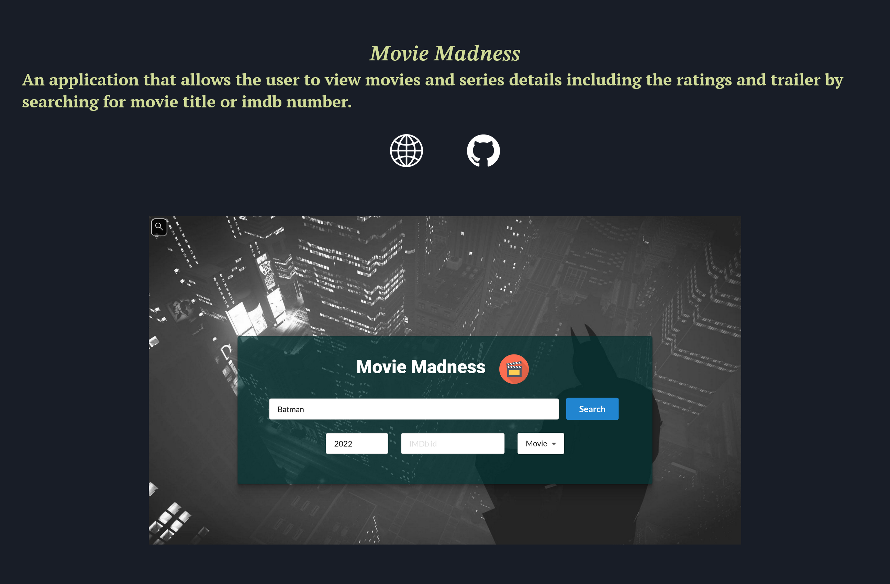

# react-portfolio

## Description

This was my first attempt at using React seriously and it was fun to mess around with. This project is a simple portfolio that focuses on presenting sections in an intuitive way. It contains an About Me section, a contact form, a project display section and a skills showcase.

## Screenshots

## Links

[Deployed Application](https://abdalehhersi.github.io/react-portfolio/index.html)

[Repository link](https://github.com/AbdalehHersi/react-portfolio)

[My github](https://github.com/AbdalehHersi)